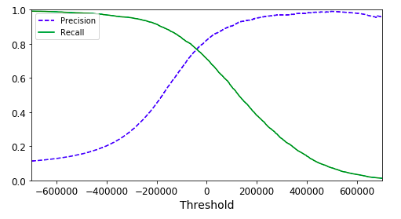
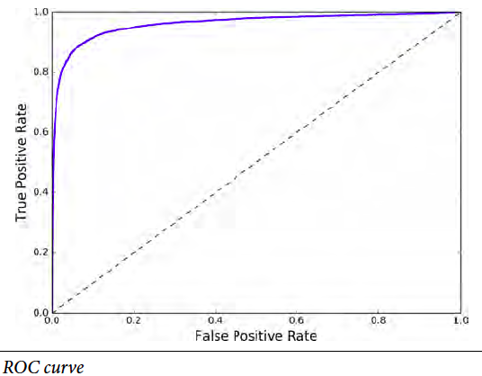

Will this stock price rise? Is this merchant trustworthy? Let's take a look at machine learning approach on classification problems. 股票会不会涨？卖家是否诚信？让我们看看机器学习如何解决分类问题。

This article opens a door to classification problems in machine learning, from the simple binary classification to more complex classification problems.
1. Binary Classification
2. Performance Measures
    * Cross-validation
    * Confusion Matrix
    * Precision, Recall, and F1 score
    * Sensitivity, Specificity, and ROC
3. Multiclass Classification
4. Models

本文敞开了通往机器学习分类问题的大门，从简单的二分类到复杂的分类问题。内容简介如下
1. 二分类
2. 表现评估
    * Cross-validation
    * Confusion Matrix
    * Precision, Recall, and F1 score
    * Sensitivity, Specificity, and ROC
3. 多项分类
4. 模型

### Binary Classification 二分类

If someone does not know MNIST dataset, he probably does not know much of classification problems. Just like programmers printing "hello world" for trying a new language, machine learners usually use MNIST datasets for trying a new classification algorithm.  
So what is this magical dataset? It is a dataset of handwritten digits from 0 to 9. For example, here is number 5.

如果某人不知道MNIST数据，那么他对分类问题很可能所知有限。就像程序员每当学新的语言总要展示"hello world"一样，机器学习家也总用MNIST数据来实验新的分类算法。那么这神奇的数据集是什么呢？它是一个手写数字的数据集。比如说下面的数字5

Binary classification, apparently, means classifying instances into two classes, "Yes" or "No", "Go" or "No Go", etc. You can probably guess that this type of algorithms is great for decision making or identification. And you are right. 

二分类，很明显，意味着把数据分成两类，“是”或“否”，“行”或“不行”，等等。不难猜到，这类算法用来做决定和识别会很棒。

### Performance Measures 表现评估  

#### Cross-Validation

Cross-Validation is one of the most important concepts in machine learning. It is so dominatingly popular that you see it from the simplest models like simple linear regression to most sophisticated models like the deep neural network. The concept is very simple and intuitive. If something, which could be a time management strategy or a body exercise plan, works for you, it does not necessarily work for others. Only until it is verified by a few other people, you can safely say this thing is generally effective.  
In our case, this "something" is a machine learning model. Here is how you do it. You train a model on part of the training data you have, then apply the trained model on the rest of the training data. After that, compare the scores of both parts. If the results are same as good, it means the model is generally effective. The first part of the data is usually called *training set*, while the second set is called *validation set*.

Cross-Validation 是机器学习里最重要的概念之一。它是如此流行，无论从最简单的线性回归，还是复杂的深度网络，你都能找到。原理很简单易懂。如果某个东西对你有效，比如说时间管理法或瘦身计划，并不代表对其他人也有用。只有被其他人验证后，它才可以总结为广泛适用的。
在机器学习里面，这个东西是我们常说的模型。你这样去做，先用部分数据来训练模型，然后用这个模型来预测剩下的数据。对比下两组数据的表现。如果一样好，那么这模型就是广泛适用的。这里第一组数据通常叫做*training set*，第二组叫做*validation set*。

#### Confusion matrix, precision, recall, and F1 score

In machine learning, we quantify the concept of "working well" models. Naturally, and in practice, in most of the cases, accuracy is a good benchmark. 
机器学习里，我们要量化模型的好坏程度。自然的，accuracy是很好的一个标准，在实践中也确实如此。

$$
accuracy  = \frac{number\ of\ correct\ predictions}{number\ of\ all\ predictions} = \frac{正确的预测的数量}{预测的总数量}
$$

Nevertheless, as I mentioned in the chapter 2 summary, while accuracy is good, sometimes it is not helpful to our concerns. This is up to the nature of the problems. For example, according to [MOH Singapore](https://www.moh.gov.sg/content/moh_web/home/statistics/infectiousDiseasesStatistics/HIV_Stats/update-on-the-hiv-aids-situation-in-singapore-2016--june-2017-.html), about 0.7% of the population is infected with HIV. If there is a project on predicting if a person is infected with HIV, one can easily get about 99.3% accuracy by stating everyone are not infected with HIV. 

然而，正如我在上节总结里提到的，accuracy尽管是个很好，但有时候跟我们关心的问题没关。这是由不同的分类问题的本质决定的。比如说，根据新加坡健康部的数据，2016年新加坡0.7%的人口有艾滋病。如果在一个估计一个人是否患艾滋病的问题中，你的accuracy可以轻松达到99.3%的高分，只需要估计结果是所有人都没得病。

To discuss alternative performance measures, I need to first introduce confusion matrix as the picture below. 
所以我们需要介绍其他的表现评估标准。首先，介绍confusion matrix如下图

Here are a few definitions.
一些定义 

**Precision**: Ratio of true(correct) predictions among all positive predictions.  所有阳性的预测中正确预测的比率
**Recall**: Ratio of positive predictions among all true predictions, aka **sensitivity** or **true positive rate**  所有正确的预测结果的中阳性预测的比率。也叫做**sensitivity**或者**true positive rate** 
**$F_1$**: A score to combine both precision and recall. precision和recall两种数据的综合分数

$$
precision = \frac{TP}{TP + FP} \\
recall = \frac{TP}{TP + FN}
$$

Most of the time, a rise in precision leads to a drop in recall. That's also why we need to find a balance using $F_1$ score.
通常，precision的升高会导致recall减少。因此我们需要用$F_1$分数来找平衡点。

To balance the two metrics, $F_1$ score is introduced as a combined metric.

$$
F_1 = \frac{2}{\frac{1}{precision}+\frac{1}{recall}}
$$

#### Sensitivity, Specificity, Receiver operating characteristic(ROC)

Similar to precision and recall pair, there is another pair of performance measures.
类似precision和recall的组合，还有另一评分组合。

$$
sensitivity(recall)=true\ positive\ rate(TPR)=\frac{TP}{TP+FN} \\
specificity = true\ negative\ rate(TNR)=\frac{TN}{TN+FP} \\
ROC=\frac{TPR}{FPR}=\frac{TPR}{1-TNR}=\frac{sensitivity}{1-specificity}
$$

### Multiclass classification 多项分类

What if there are more just "Yes" or "No"? Don't worry, expanding from binary classification, we have the multiclass classification. Some classification models can be easily expanded from two classes to multiple classes, like the decision tree. But some are meant for binary classification in nature, like SVM. In the second case, the model will split multiclass classification problems into several binary classification problems and combine the results. Again, I don't want to discuss deeper than the basic concept.

如果分类不只“是”或“否”，“行”或“不行”怎么办？别担心，二项分类可以拓展到多项分类。有些分类模型可以轻松拓展，不如说决策树。有些模型则只是用来做二项分类的，比如说向量机。后者如果用来解决多项分类的问题，则需要把多项分类问题分解成多个二项分类问题，再综合结果。这里不深入了。

### Models 模型

To avoid introducing too many concepts at the same time, I have intended not to mention any specific models until now. Here are several common models for classification. You can search them on your own if you are interested.
为了防止一次介绍太多内容，我之前刻意没提及用来分类的模型。下面是常用的模型，可以根据自己兴趣自行深入学习。
* Support Vector Machine (SVM)  向量机
* Logistic Regression Classifier 逻辑回归分类
* Nearest Neighborhood  近邻算法
* Decision Tree  决策树
* Random Forest  随机森林
* Native Bayes  朴素贝叶斯算法
* XGBoost (It is more a tool than a model. But I feel it is necessary to mention it as it performs extremely well on Kaggle.) （XGBoost其实是一个库，而不是模型，不过在kaggle里表现非常好，因此有必要）
* Neural Network  神经网络

*This article is part of a series of summaries of the book Hands-On Machine Learning with Scikit-Learn and TensorFlow. The summaries are meant to explain machine learning concepts and ideas, instead of covering the maths and models.* 

*本文是《Hands-On Machine Learning with Scikit-Learn and TensorFlow》这本书的总结随笔系列的一部分。总结旨在解释机器学习的观念和想法，而不是数学和模型*
