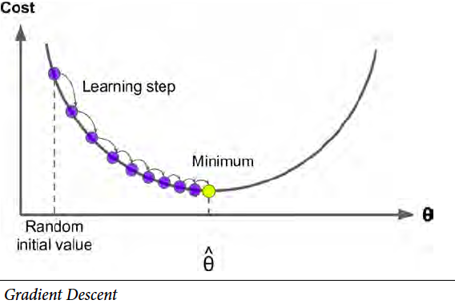
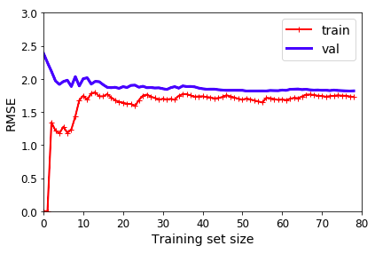
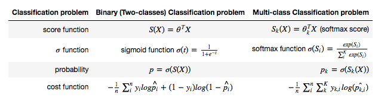

How much is a 1000 square feet house? How many customers can I expect tomorrow? Let's take a look at machine learning approach on regression problem. 百平米房子多少钱？明天能来多少顾客？让我们看一下机器学习如何解决回归问题。

In this chapter summary, I will show how linear and logistic regression works. Linear algebra behind the model is not the focus.

在这节总结中，我将展示线性回归和逻辑回归的简单原理。模型中的线性代数不被讨论。故而篇幅略短

Here is the structure of this summary. 这是本总结的结构
1. Linear regression  线性回归
    1. Gradient descent  
    2. Regularization
2. Logistic regression  逻辑回归
    1. Logit Regression
    2. Softmax Regression

### Linear Regression 线性回归

**Simple linear regression** is one of the most basic machine learning models. It has been well studied from all aspects by statisticians, for example, closed-form solution, ANOVA test on lack of fit, confidence interval, confidence band, prediction interval, residual variance check, p-value on each parameter, etc. While statisticians care a lot about fitting and confidence, machine learners don't seem to really care that much. Instead, cross-validation, hyper-parameter tuning, memory and time complexity, underfitting and overfitting, learning rate are more of interest to machine learners. So one can get some ideas on the difference between statistics and machine learning, on both their approaches and goals. 

When you have more than one feature, use **Multivariant linear regression**. If the data is more complex than a straight line or hyperplane, use **Polynomial linear regression**.

**简单线性回归** 是最基本的机器模型之一。被统计学家从各个角度研究，比如闭式解，ANOVA 测试，置信区间, confidence band, prediction interval, residual variance check, p值, 等等。而相比来讲，机器学习家们对 cross-validation, 超参调整, 时间和内存复杂性, 欠拟合和过拟合, learning rate 更感兴趣。管中窥豹，我们可以看出统计和机器学习在方法和目标上的区别。

当不止一个变量时，可以用**Multivariant linear regression**。如果数据不只是简单的直线或平面，可以用**Polynomial linear regression**。

#### Gradient descent 梯度下降

It is well-known that there is closed-form solution for simple linear regression. However, it does not really fit large datasets. This is because it needs to calculate the reverse operation of a matrix of size NxN, where N stands for a number of instances. The time complexity of closed-form solution is about $O(m^{2.4})\sim O(m^3)$ for number of features $m$, and $O(n)$ for number of instance $n$. What's more, it requires an adequate amount of memory. The closed-form solution could easily blow off the memory space for large datasets.

众所周知，简单线性回归是有闭式解的。然而，对于比较大的数据集，并不怎么好用。这是因为需要计算一个NxN大小的矩阵的逆矩阵，其中N是样本数量。闭式解的时间复杂度$O(m^{2.4})\sim O(m^3)$，m是变量数目。闭式解的时间复杂度$O(n)$，n是样本数目。更者，闭式解需要大量的内存。大数据集很容易超过内存大小。

To handle large datasets, gradient descent is used. The idea is to improve the parameters by a small amount every step before eventually reaching optimal values. It is very "computer science". The approach is called **Batch Gradient Descent**.   

However, it is still very memory-expensive to dump the whole dataset into matrix calculation. So a derived version, **Stochastic Gradient Descent (SGD)**, is more commonly used where only one instance data is used at a time. The word *stochastic* refers to the fact that the order of data feed is stochastic. This approach is much faster than Batch gradient descent with some small drawbacks (not discussed here). 

为了处理大数据集的问题，我们利用梯度下降的方式，一步步改善参数，直到找到最优解。这个想法非常“计算机”。这个模型被叫做**随机梯度下降**。   

然而，一次性把所有数据都载入到内存的做法，仍然有一定的限制。因此演化版本**随机梯度下降(SGD)**被更常用到。在SGD算法中，一次只需要用一个样本数据。随机的意思是说数据的选取是随机的。尽管有些小副作用，SGD算法回归的很快。

Just to make the picture complete, I need to mention a combined version of the two approaches mentioned above is called **Mini-batch Gradient Descent**. 

之前两种算法结合起来，有**小批量梯度下降**算法。



It worth mentioning the learning rate hyper-parameter. If the learning rate is too large, you end up jumping around the optimal solution instead of hitting it. If the learning rate is too small, the training can take a long time. Also, small learning rate may lead you to the trap of local minimal. 

值得一提learning rate这个超参数。如果learning rate很大，你有可能取不到最优解，而是在最优解周围震荡。如果learning rate太小，训练时间会很长，还有local minimal的问题。


```python
# To support both python 2 and python 3
from __future__ import division, print_function, unicode_literals

import numpy as np
import pandas as pd
import matplotlib.pyplot as plt
plt.rcParams['axes.labelsize'] = 14
plt.rcParams['xtick.labelsize'] = 12
plt.rcParams['ytick.labelsize'] = 12
%matplotlib inline

X = 2 * np.random.rand(100, 1)
y = 4 + 3 * X + np.random.randn(100, 1)
from sklearn.linear_model import SGDRegressor
sgd_reg = SGDRegressor(max_iter=50, penalty=None, eta0=0.1)
sgd_reg.fit(X, y.ravel())
sgd_reg.intercept_, sgd_reg.coef_
```

```
(array([3.80549194]), array([3.28373567]))
```

#### Regularization 正则

The performance of the model can be evaluated with validation set. For example, errors plot for both training set and validation set gives a very good idea of how well the model is. Here is a figure of error vs training size set.

模型的表现可以用验证集来评估。比较训练集和验证集的残留曲线，我们可以很好了解模型的表现。如下


```python
from sklearn.metrics import mean_squared_error
from sklearn.model_selection import train_test_split
def plot_learning_curves(model, X, y):
    X_train, X_val, y_train, y_val = train_test_split(X, y, test_size=0.2)
    train_errors, val_errors = [], []
    for m in range(1, len(X_train)):
        model.fit(X_train[:m], y_train[:m])
        y_train_predict = model.predict(X_train[:m])
        y_val_predict = model.predict(X_val)
        train_errors.append(mean_squared_error(y_train_predict, y_train[:m]))
        val_errors.append(mean_squared_error(y_val_predict, y_val))
    plt.plot(np.sqrt(train_errors), "r-+", linewidth=2, label="train")
    plt.plot(np.sqrt(val_errors), "b-", linewidth=3, label="val")


from sklearn.linear_model import LinearRegression
lin_reg = LinearRegression()
plot_learning_curves(lin_reg, X, y)
```




If the gap between training and validation set is very big, the model is probably overfitting.
To reduce overfitting, regularization is added to the model. Three approaches are commonly used.
* Ridge
* Lasso
* Elastic Net (a combination of Ridge of Lasso)

如果training set 和 validation set 的区别很大，那么模型很可能过拟合了。为了减小过拟合的问题，可以采用正则的方式。下面是常用的正则方法。
* Ridge
* Lasso
* Elastic Net (a combination of Ridge of Lasso)

### Logistic Regression 逻辑回归

Logistic regression is one of the basic classification models. It is usually discussed right after linear regression in many machine learning materials since their model structures shares a lot in common. 

Recall that output from linear regression is in the range of $(-\infty,\infty)$. The main idea of logistic regression is to convert the score function result from the range of $(-\infty,\infty)$ to $(0,1)$, which is the desired range for probability. For binary classification problems, use **Logit regression** as the conversion function. For multi-class classification problems, use **Softmax regression**. Correspondingly, the cost function has also changed. It is the mean of log probability of the prediction result.

A comparison table says 100 times more than words. 

逻辑回归是基本的分类模型之一。在大部分机器学习的学习材料中，因为模型有很多共通的地方，逻辑回归通常接在线性回归后介绍。

其中一个不同的地方是cost function。线性回归的结果是 $(-\infty,\infty)$ 的。逻辑回归正是要把 $(-\infty,\infty)$ 转换到$(0,1)$。而$(0,1)$正好是概率的范围。对于二分类，用**Logit regression**作为转换的方程。对于多类分类，用**Softmax regression**。相应的，cost function也不同了，是log probability的均值。说一万字，不如上表格。




*This article is part of a series of summaries on the book Hands-On Machine Learning with Scikit-Learn and TensorFlow. The summaries are meant to explain machine learning concepts and ideas, instead of covering the maths and models.* 
*本文是《Hands-On Machine Learning with Scikit-Learn and TensorFlow》这本书的总结随笔系列的一部分。总结旨在解释机器学习的观念和想法，而不是数学和模型*
