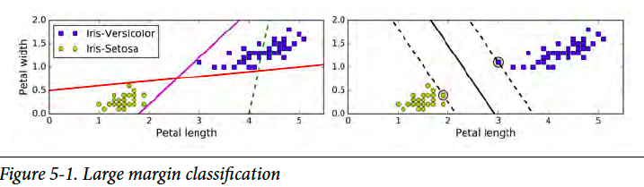
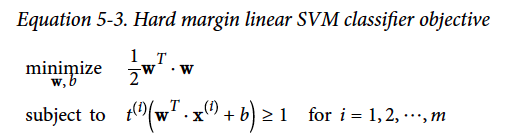
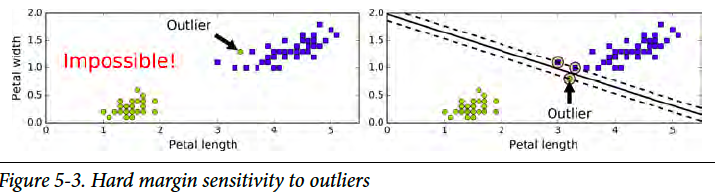
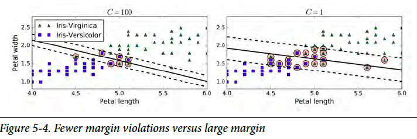
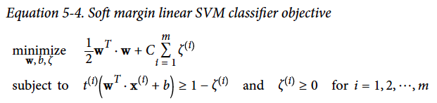
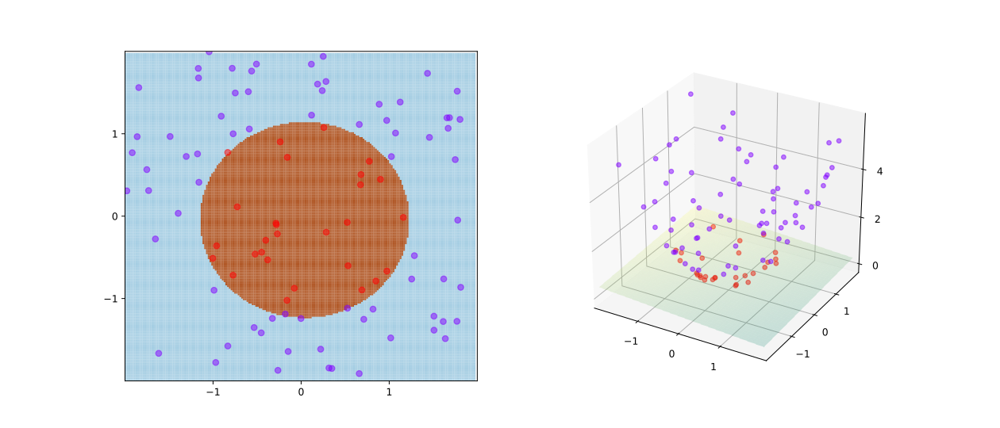
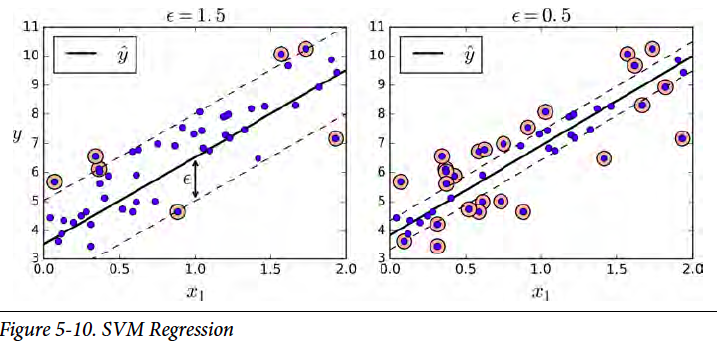

*This article is part of a series of summaries on the book Hands-On Machine Learning with Scikit-Learn and TensorFlow. The summaries are meant to explain machine learning concepts and ideas, instead of covering the maths and models.* 

*本文是《Hands-On Machine Learning with Scikit-Learn and TensorFlow》这本书的总结随笔系列的一部分。总结旨在解释机器学习的观念和想法，而不是数学和模型*

In this chapter summary, I will show how SVM works. Linear algebra behind the model is not the focus.
在这节总结中，我将展示向量机的简单原理。模型中的线性代数不被讨论。故而篇幅略短

Here is the structure of this summary. 这是本总结的结构
1. Linear SVM Classification  线性向量机分类
    1. Hard Margin  
    2. Soft Margin
2. Nonlinear SVM Classification  非线性向量机分类
3. SVM Regression  向量机回归

Support Vector Machine (SVM) is a very powerful and versatile Machine Learning model. It can be applied to many types of problems, classification, regression, etc. 
向量机很好很强大。可以用到很多方面。

** IMPORTANT!!! It is especially useful for classification of complex but small- or medium-sized datasets. **  


** 敲黑板！！！ 向量机尤其适合应用于复杂的中小数据的分类问题 **  

## Linear SVM Classification 线性向量机分类问题

We can think the classification problem is to separate datasets into different groups with minimum uncertainty, while different models give different definitions of "uncertainty".  

Many classification models consider most of the data points in the datasets. Recall that in Logistic Regression, the score function comes from the mean of log-likelihood. In Decision Tree, at each leaf, all data points are used to calculate the score to produce decision rules. 

On the other hand, SVM does not consider all data points, not even the majority of data points. The model is decided by only a few data points out of the whole datasets. Take a look at data points below, it is obvious that only those points near the separation border affect the final model.  


我们可以这样想，分类问题，无非就是在最低不确定性的情况下，把数据分到不同的组。而不同的模型则是对于“不确定性”给予不同的定义。
许多分类模型会用到绝大部份数据。回顾，在逻辑回归中，score function (暂翻译成评分函数）是 log-likelihood 的均值。在决策树模型里，计算分支时，每一个数据都会用到。然而，我们的向量机可以很任性的无需全部的数据，甚至不需要大半的数据。向量机的模型只需要其中的几个数据点而决定。如下图，分类的边界线只跟线附近的几个点有关。



### Hard Margin （暂翻译为硬边际）

Let's assume the datasets are linearly separatable. That is to say, there exists a hyperplane that can completely and cleanly separate the datasets into different classes. In a 2-D 2-classes case, there exists a line separating the datasets. So here is the question, as there are more than one possible lines, which one gives minimum uncertainty? To answer this question, let's first define a margin variable as the distance from the hyperplane to the nearest training data point of any class. In SVM, the larger this distance is, the less uncertainty there is. The score function is to maximize this distance. 

假设数据是可以线性分割的。也就是说，存在一种超平面，可以很清楚地把数据分成不同的类。在2维2类的问题里，则存在这样的分割线。然而，这样的线可以同时存在很多条，哪个是最低“不确定性”呢？为了解决这个问题，先这样定义一个代表边际的变量，边际的距离为超平面到最近点的距离。在向量机里，这个边际距离越大，不确定性越小。score function (暂翻译成评分函数）是为了最大化的边际距离。

Here is the objective function for hard margin linear SVM. (It is Ok if you do not understand. The formulation is presented here as I want to show the comparison of hard margin and soft margin.)

下面是硬边际的目标方程。（不懂也没关系，这个方程只是为了展示硬软边际的区别。想知更多，请查专业书籍）



### Soft Margin （暂翻译为软边际）

What if the datasets are not separatable? Then we need soft margin. We use a parameter *C* to adjust the "softness". Another advantage of soft margin is insensitive to outliers. The "softer" the model is, the model is more tolerable to margin violations.

如果数据不能分割开呢？那就需要软边际了。我们用一个参数*C*来调整*软度*。用软边际的另一个好处，就是免疫离群值。边际越“软”，对于越过边界线数据的容忍度越高。





Here is the objective function for hard margin linear SVM. (It is Ok if you do not understand. The formulation is presented here as I want to show the comparison of hard margin and soft margin.)
下面是软边际的目标方程。（不懂也没关系，这个方程只是为了展示硬软边际的区别。想知更多，请查专业书籍）



## Nonlinear SVM Classification  非线性向量机分类

It is ideal if datasets can be linearly separated by a straight line. However, life is hard. We have to handle non-linear cases. The approach is to transform explanatory variables (X) so that the problem can be fitted to linear SVM. The original datasets (left) cannot be separated by a line. However, after transforming X into higher-dimension datasets like the figure on the right.

如果数据可以任由超平面完美的分隔开，那简直太美了。然而社会是残酷的。为了解决非线性问题，我们对变量进行转换，让其可以被线性向量机解决。如下图，原始数据（左）无法被分开，然后把数据转换成更高维数据（如右图）。转换后，就可以由一个平面分开了。



To implement the transformation, sci-kit learn apply a technique called *kernel trick*. Common kernels include Polynomial Kernel and Gaussian RBF Kernel. 

实践这样的转换，sci-kit learn这个工具用了叫做*核心*的技巧。常用的核心有Polynomial Kernel 和 Gaussian RBF Kernel。


```python
from sklearn.svm import SVC
SVC(kernel="poly", degree=3, coef0=1, C=5) # Polynomial Kernel
SVC(kernel="rbf", gamma=5, C=0.001) # Gaussian RBF Kernel
```


## SVM Regression  向量机回归

For a regression problem, we usually picture the data points are scattered around the fitted line. Comparably, in a classification problem, the data points are scattered away from the borderline. So do you notice the similarity? Yes, by reversing the idea of SVM classifier, we obtain the SVM regressor. Instead of trying to exclude as many data points as possible in the border band in SVM classifier, we try to include as many data points in the regression line band in SVM regressor. 

在回归问题里，我们通常会这么假设，数据是分布在回归线一定范围之内的。相比之下，在分类问题里，数据是分布在分割线两边之外的。发现了么，把向量机分类的模型反转一下，就可以用来解决回归问题。在分类里，在分割线附近，向量机尽量排空数据。在回归问题里，回归线附近尽量包含更多的数据。


