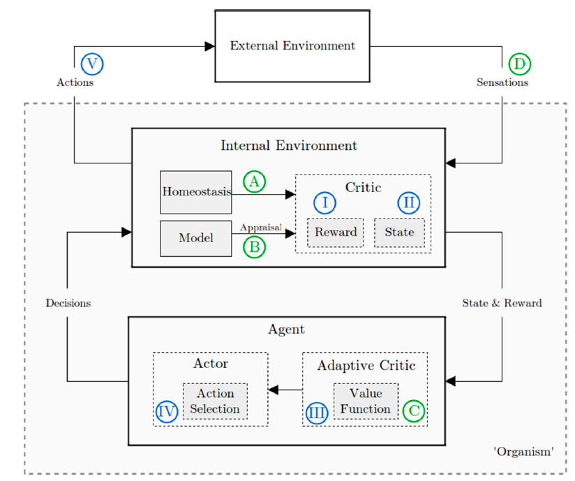
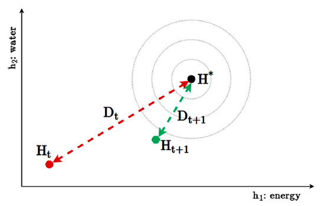

# Summary of _Emotion in reinforcement learning agents and robots: a survey_

_The original paper can be found [atXiv.org](https://arxiv.org/abs/1705.05172)_ 

## Introduction

Since Alpha Go in 2015, machine learning (ML) and artificial intelligence (AI) community have witnessed a blowout of achievements involving deep learning. Robots now can read what they see, understand what they hear, and beat human players on board games like Go. The huge improvement on AI intrigues us questions on how far it is for robots to behave like humans. One of the major challenges for robots is emotion. The article provides the first survey of computational models of emotions in reinforcement learning (RL) agents. It discusses what emotions are, how emotions are elicited and why implementing emotions in RL agents, in the AI context.

A systematic Google Scholar search on "emotion and RL" is performed to obtain the research papers in this area. This resulted in 52 papers included in the survey. Thus, the survey can be considered as being systematically conducted.

This summary of the survey (original paper) focuses on introducing the definition of emotion, this abstraction concept, as well as ways to measure the level of emotions. So that readers can get a rough concept of emotions and get inspirations for implementing emotion in various machine learning applications.

## Background

Many papers included in the survey are built upon psychological and neuroscientific theories. Subsequently, the survey position the work in the ML community. Some background information is provided here for further discussion and comparison.

### Psychology - emotion anatomy 

Three dominant emotion theories are discussed, categorical, dimensional and componential.

* **Categorical emotion theory** assumes there is a set of discrete emotions forming the 'basic' emotions. The ancient Greek believed that everything is made of four basic elements: *earth, water, air* and *fire*. Similarly, we can think emotions are made out of some sets of basic emotions. For example, anger, fear, joy, sadness, surprise, and disgust. Like fire is associated with heat, fear is associated with avoidance actions.

* **Dimensional emotion theory** assumes an underlying affective space. Recall that in high school, we learned that every point can be represented by its projections on the 3 dimensions in space, *x,y,z*. Similarly, affective space may have more than two dimensions: usually valence (i.e. positive/negative evaluation) and arousal (i.e. activation level). For example, fear is a highly arousing and negative affective state.

* Finally, **componential emotion theory**, best known as cognitive appraisal theory, considers emotions as the results of evaluations (appraisals) of incoming stimuli according to personal relevance. Some examples of frequently occurring appraisal dimensions are valence, novelty, goal relevance, goal congruence, and coping potential. Distinct emotions relate to specific patterns of appraisal activation. For example, anger is a result of evaluating a situation as harmful to one’s own goals with the emotion attributed to the responsible actor and at least some feeling of power.

### Neuroscience

It suggests that emotions are closely linked to reward processing. This idea is implicitly reflected in part of the reinforcement learning-based implementations in AI.

### Reinforcement Learning (RL)

With the key consideration of goal and rewards, RL is a successful approach that enables autonomous agents to learn from interaction with their environment. The RL model adopts a Markov Decision Process (MDP) specified by states (S), actions (A), transition functions (T), reward functions (R) and a discount function (γ). The goal is to find a policy (π), which maximizes value function Q(π,a).

An important aspect in RL is the reward source. Two types of rewards are identified, extrinsic rewards, which is related to stimuli/goals in the external world, and intrinsic rewards, which depends on agent history and internal states. 

## Emotion Elicitation - emotion measurement

The survey identifies four major categories of emotion elicitation: extrinsic/homeostatic, intrinsic/appraisal, value function and reward-based, and finally hardwired. The hard-wired method does not provide any deeper understanding and is not discussed.

### Homeostasis and extrinsic motivation

The organism&#39;s full physiological state ( **H** ) consists of a set of homeostatic variables. Each homeostatic variable has a certain point. The distance between current value and the set points creates the drive ( **D** ) for external stimuli/resources. And the drive will affect the emotions elicited. For example, the more hunger a person is, the more he desires sugars, and the more happiness is elicited when he receives sugars.

### Appraisal and intrinsic motivation

In Appraisal theory, a particular stimulus can be decomposed into combinations of appraisal dimensions, which form a basis for emotion elicitation. Examples of appraisal dimensions are novelty, recency, control and motivational relevance. And some appraisals can be formularized in RL models by making use of the elements like S, T, a (Refer to Reinforcement Learning in the previous section).

### Value function and reward

The third branch of emotion elicitation methods in RL focusses on the value and reward functions. It associates the emotions with the rewards. A simple example is, a robot is &quot;happier&quot; when it receives more rewards.

## Evaluation

The survey identifies emotions may be useful to the agent in three main categories: learning efficiency, emotion dynamics and human-robot interaction (HRI). However, no quantitative results were given in the survey.

## Discussion and Conclusion

In general, the survey intended to provide a framework. It provides advice for implementation emotions in RL agents.  It suggests that researchers focus on integrating approaches.

Many problems have been observed by the survey. One is that almost none of the scenario was reproduced by others. Another problem is that the author was not unable to fully reduce the details of each implementation. It makes it hard to compare implementation. One more problem is lack of common evaluation criteria. All these problems bring to a final problem, the challenge to bring all aspects into one larger system. This is the core challenge for the future.
