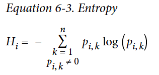

What is Decision Tree? How is it different from other models? Let's understand our first non-linear model, non-parametric model. 何为决策树？跟其他模型区别在哪儿？来了解我们第一个非线性的非参数的模型。

*In this chapter summary, I will briefly introduce how Decision Tree in Scikit-Learn works, as well as measurement of impurity.*
*在这节总结中，我将展示决策树的简单原理。*

#### Table of Content 内容提要  

* CART  分类和回归树
* Impurity  不纯度
* Cost function  代价函数
* Probability  概率
* Regularization  正则 
* Regression  回归

Like SVMs (introduced in Chapter 5 Summary), Decision Trees are versatile Machine Learning algorithms that can perform both classification and regression tasks. They are very powerful algorithms, capable of fitting complex datasets.  
正如支持向量机（详见第五章总结中介绍），决策树也是一种全面的机器学习算法，既可以解决分类问题，也适用于回归问题。决策树很强大，可以应对复杂的数据集。

### What is a Decision Tree 决策树是什么

What is a decision tree? Decision Trees are tree-like models, where each node contain a subset of the datasets and, if it is a nonleaf node, makes decisions on how the subset can be further split into more branches.  
决策树是树形模型。每个节点包含了数据集的子集。在非终端节点上，节点对于如何继续分割子集作出决策。  
{: .center-image }  
In the chart above, there are 150 samples in the top-level node. These samples are split into two subsets based on whether their *pental length<=2.45*.  
在上图中，初始节点（顶层节点）有150个样本。然后根据*pental length<=2.45*的标准，分成了两个子集。

### Classification and Regression Tree (CART) 分类和回归树 
There are many algorithms for Decision Trees. Scikit-Learn uses the CART algorithm, which produces only binary trees: nonleaf nodes always have two children. As you can tell from the name, CART can be applied to both classification and regression problems. You can probably tell that there are also algorithms produces more than just two children; one example is ID3.  
决策树模型又分有很多算法。Scikit-Learn采用了CART算法，生成的是二项树，也就是非末端的节点会被分为两个子集。既然叫做分类和回归树，CART显然是既可解决分类问题，又可解决回归问题。还有生成不止两个子集的算法，比如ID3。
 
### Impurity 不纯度
At nonleaf nodes, Decision Trees make decision on how to further split the dataset based on certain criteria. How are these criteria decided? Intuitively,  in a classification problem, we wish a split could separate instances of different classes as distinct as possible. In the best case, one subset will contain instances from one class, the other subset the other class. In another word, we hope the subset as *pure* as possible. And the best split should give the least impurity.  
决策树根据一定的标准，把非末端节点分割成两个子集。那么这标准又如何选择呢？直觉上，在分类问题里，我们希望把样本分得越清楚越好。理想情况下，一个子集只包含一个类，即子集越“纯粹”越好。最好的分割方式应该让“不纯度”最小。 

Now we need some measurements of impurity. Here are two common ones.  
接下啦，我们我们要对“不纯度”定量。两个常用个的标准如下。  

* __gini_impurity__ __基尼不纯度__  
{: .center-image }  

* __Entropy__ __熵__  
{: .center-image }  

subscript $i$ is for nodes, subscript $k$ for classes. For example, in the decision tree shown just now, at the top-level node, $p_{i,1}=p_{i,2}=p_{i,3}=\frac{50}{150}=0.33$. $G_i=1-\sum_{k=1}^3p_{i,k}^2=1-3*0.33*0.33=0.667$.  
其中，角标$i$是节点，角标$k$对应类。在之前的决策树例子中，在初始节点，$p_{i,1}=p_{i,2}=p_{i,3}=\frac{50}{150}=0.33$. $G_i=1-\sum_{k=1}^3p_{i,k}^2=1-3*0.33*0.33=0.667$。  

It is easy to tell that these two metric changes almost the same way when $p_{i,k}$ changes. So they are almost equivalent.  
很容易看出，当$p_{i,k}$ 变化时，这两个标准的值的变化几乎一致。这两种标准基本上是等价的。

A reduction of entropy is often called an **information gain**.  
熵的减量通常被叫做信息增益。

### Cost function for Classification 分类问题的代价函数  
To minimize the impurity, we can subsequently define the cost function of each split as 以着最小化不纯度的标准，定义代价函数如下
  
其中，$G_{left/right}$是左/右子集的不纯度。$m_{left/right}$是左/右子集的样本数量。

### Regularization 正则
Now we know how to split at a single node. Iterating this process on all the produced children node generates a decision tree.  
我们已经知道如何分割单个节点。迭代这个过程，我们就生成了决策树。

When do we stop splitting? If we only stop when there is no more impurity, we are obviously just remembering the mapping, which is an extreme case of overfitting. To regularize, there are various hyperparameters to put an early stop to the decision tree growing. Common hyperparameters are `max_depth`, `min_sample_split`, etc. And again, cross-validation is our good friend on checking overfitting.  
不过，分割过程该何时停止呢？如果分到分无可分，我们相当于把整个数据集背了下来。这明显是极端过拟合的情况。有很多超参数可以让决策树提前停止迭代。常见的超参数有`max_depth`, `min_sample_split`等。当然，别忘了我们的检验过拟合的好朋友cross-validation.

### Probability 概率 
A Decision Tree can also estimate the probability that an instance belongs to a particular class k: first it traverses the tree to find the leaf node for this instance, and then it returns the ratio of training instances of class k in this node.  
决策树怎么给出预计概率呢？首先要决定叶子节点，此节点中属于k类的样本的比重，即为k类的概率。

### Regression 回归
We have previously mentioned that CART can also be used for regression problem. The CART algorithm works mostly the same way as earlier, except that instead of trying to split the training set in a way that minimizes impurity, it now tries to split the training set in a way that minimizes the MSE.  
之前我们提到，CART也可以用来解决回归问题。大体步骤跟之前一样。唯一不同的是，在分类问题中分割的目标是最小化不纯度，在回归问题中，最小化的是均方误差(MSE)。  

 

#### Discussion 讨论
A single decision tree model suffers a few issues. For example, the split can only be orthogonal to the axes, which makes it suffer from dataset rotation. Besides, Decision Trees are sensitive to small variations in the training data.  
How to overcome these issues? You will see it in the next summary, the Ensemble methods. 
单一的决策树面临一些问题。比如，分割一定是垂直于坐标轴的，数据集相对于坐标轴的旋转会导致些困扰。决策树也对训练集的改变很敏感。如何解决这些问题呢？敬请期待下篇总结：集成方法。

*This article is part of a series of summaries on the book Hands-On Machine Learning with Scikit-Learn and TensorFlow. The summaries are meant to explain machine learning concepts and ideas, instead of covering the maths behind the models.*  
*本文是《Hands-On Machine Learning with Scikit-Learn and TensorFlow》这本书的总结随笔系列的一部分。总结旨在解释机器学习的观念和想法，而不是数学和模型*

